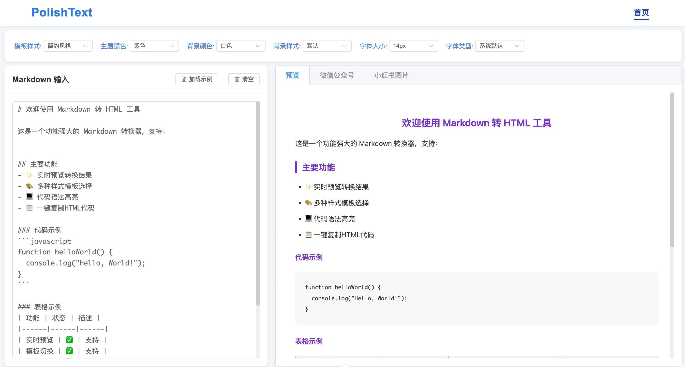
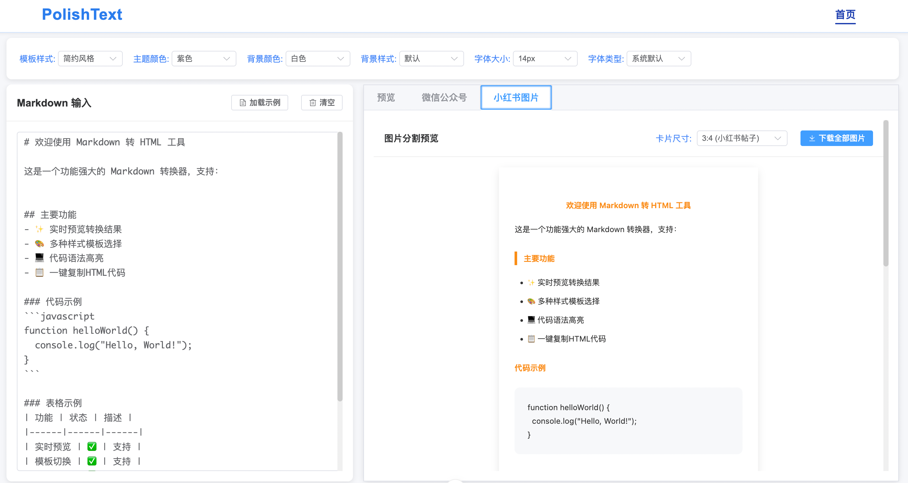

# PolishText
将markdown转为微信公众号文章和小红书图片。

# 功能简介
用户可以动态选择`模板样式`、`主题颜色`、`背景颜色`、`背景样式`、`字体大小`、`字体`后，直接转化为微信公众号文章和小红书图片。




# 快速开始
本项目使用vue+ element-ui开发，使用vite作为项目管理工具。所以需要先安装node环境。安装好环境后，可以按照以下步骤进行：

1. 下载项目
```shell
git clone https://github.com/Fancy-hjyp/PolishText.git
```

2. 安装依赖
```shell
npm install
```

3. 启动项目
```shell
npm run server
```
项目启动后，可以访问`http://localhost:5173`查看项目。

# 项目详细介绍
项目使用`vite`作为项目管理工具，`vue-router`作为路由工具，`element-ui`作为UI组件库。

* `App.vue`是整个页面的入口文件，包含顶部的导航栏，中间的`router-view`，底部的`footer`。

* 所有的页面都放在`src/views`目录下，页面之间通过`router-view`进行跳转。

* 所有的组件都放在`src/components`目录下，组件之间通过`props`进行数据传递。

* `router.js`是路由配置文件，包含所有的路由配置。

* `store.js`是状态管理文件，包含所有的状态管理。

* `src/api` 包下是所有的接口请求文件，包含所有的接口请求。

# 核心技术点
* **样式内连**：复制为微信格式时，先使用`juice`合并内连样式，然后使用`ClipboardItem`将富文本文本复制到剪切板，以便粘贴`html`格式内容。
    * 内连样式不会带上字体样式，所以内连后动态加上字体相关样式。
* **长文切分**：小红书图片生成时，动态计算图片高度，若高度大于指定高度，则切分。切分时需要计算切分维度，尽量不要将完整的内容切开。递归切分。
* **动态模板**： 内置多个样式模板，通过变量改变样式。